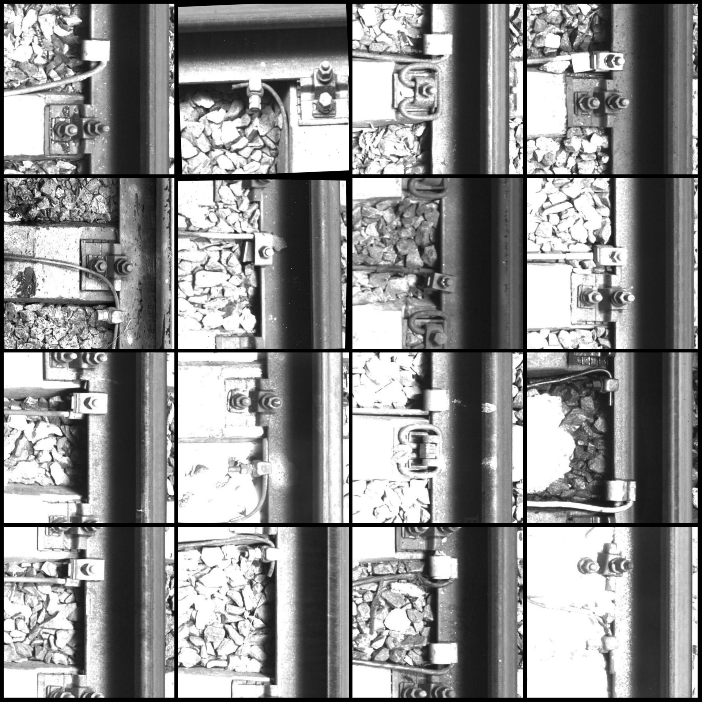
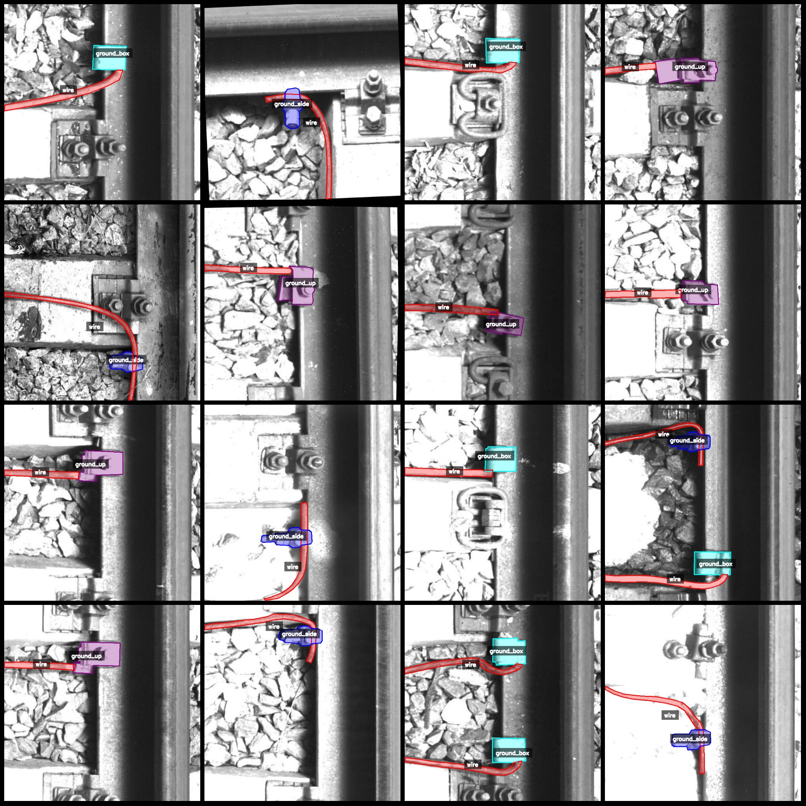
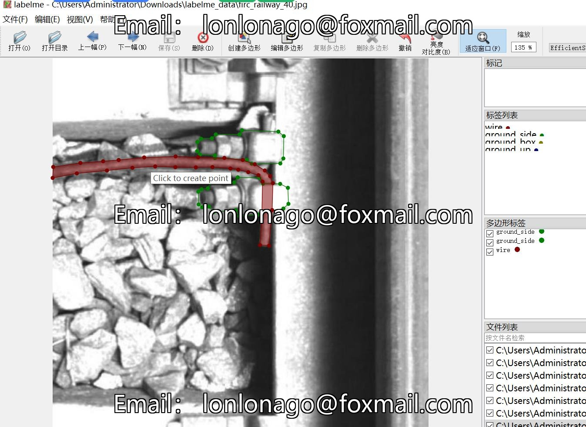

# Smart Railway Track Ground Module Electricity Wiring Data Set

The dataset is in the labelme format (excluding mask files, only containing JPG images and corresponding JSON files).

- Number of image files (JPG): 534
- Number of annotation files (JSON): 534
- Number of annotation categories: 4
- Annotation category names: ["wire", "ground_side", "ground_box", "ground_up"]
- Count of boxes for each category:
  - wire (electricity wiring) count = 575
  - ground_side (side of the track) count = 154
  - ground_box (stationary box) count = 240
  - ground_up (above ground level) count = 186
- Total number of boxes: 1155

Using annotation tool: labelme=5.5.0
Located in repository: firc-dataset
Image resolution: 640x640
Dataset has been enhanced to some extent
Annotation rule: Polygons are drawn around the categories

Important note: The dataset can be edited using the labelme tool. JSON datasets need to be converted into either mask or YOLOF/COCO format for instance segmentation or semantic segmentation.

Special declaration: This dataset does not guarantee the accuracy of the models trained on it or the weights files.

Preview of the images:

Annotation example:

Original image:
Annotation drawing result:

## Images

Here is a pay link on Stripe ( https://buy.stripe.com/3cs8yP7sY87d0vu9AB ). Please contact me lonlonago@foxmail.com after funding $89, and I will send you a complete data files , thank you!

